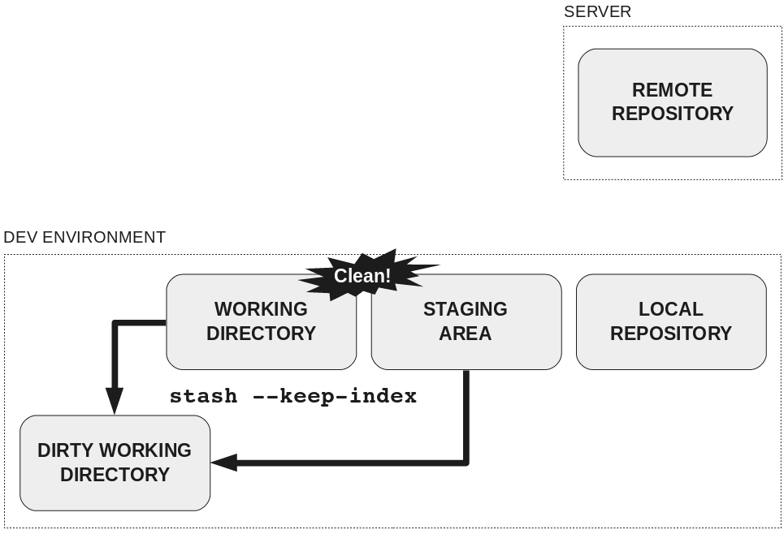

# Git

NOTE: ``` -- ``` means _no more options; the following is a file_


* Staging = index
* A _shallow_ clone with last 100 commits: ```git clone --depth 100 URL```


* Add all files: ```git add -A```
* Add only updated files (already tracked): ```git add -u```
* Add certain changes of each file: ```git add -p``` (interactive way)
* Include in last commit (not pushed) with the same comment: ```git commit -C HEAD --amend```
* Undo:
    * A change: ```git checkout -- [file]```
    * A file in staging: ```git reset HEAD -- [file]```
    * All changes and staged files (return to last commit): ```git reset --hard HEAD```


* Git can't track empty directories. To track them, you can add an empty file as ```.include_in_git```
* Remove all untracked files: ```git clean```





## Status

```git status```

```git status --short```:
    * ??: new
    * A: staged
    * M: modified
    * _M: mofified, not staged
    * M_: modified and staged
    * MM: modified and staged; modified again without staged

## Tags

Two types:
* Lightweight tags (only a name for a commit): ```git tag <name>```
* Annotated tag (they are meant for release; they contain a creation date, the tagger name and e-mail, a tagging message, and an optional GnuPG signature): ```git tag -a <name> -m <message>```

And: ```git push origin --tags``` or ```git push origin <tagname>```

## Logs

* ```git log```
* To see changes: ```git log -p```
* To see last x changes: ```git log -p -[x]```
* Statistics: ```git log --stat```
* Formats:
    * ```git log --pretty=oneline```
    * ```git log --pretty=short```
    * ```git log --pretty=full```
    * ```git log --pretty=fuller```
    * ```git log --pretty=format:"%h - %an, %ar : %s"```
* Filters (to apply several filters: ```--all-match```):
    * ```git log --since=2.weeks```
    * ```git log --since="2008-01-15"```
    * ```git log --since="2 years 1 day 3 minutes ago"```
    * ```git log --author=<author>```
    * ```git log --grep=<words in commit message>```
    * ```git log -S<changed string in commit>```
    * ```git log --<path of modified file in commit>```
