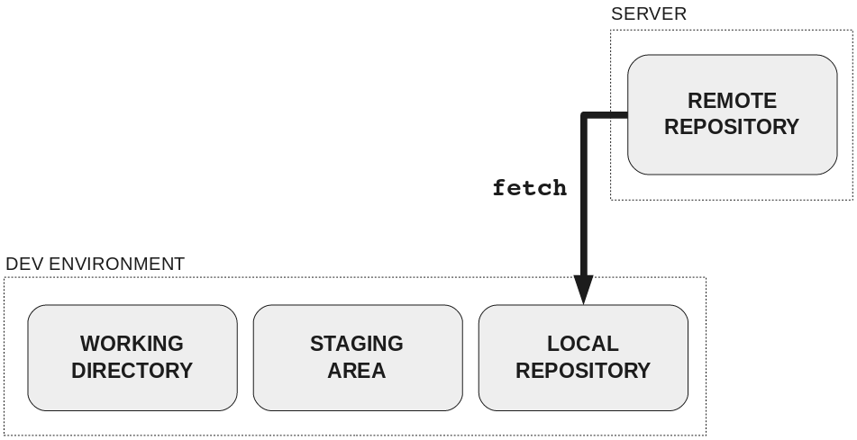

# Git


* Staging = index
* A _shallow_ clone with the last 100 commits: ```git clone --depth 100 URL```


* Add all files: ```git add -A```
* Add only updated files (already tracked): ```git add -u```
* Add certain changes of each file: ```git add -p``` (interactive way)
* Include in last commit (not pushed) with the same comment: ```git ci -C HEAD --amend```
* Undo:
    * A change: ```git checkout -- [file]```
    * A file in staging: ```git reset HEAD -- [file]```
    * All changes and staged files (return to last commit): ```git reset --hard HEAD```


* Git can't track empty directories. To track them, you can add an empty file as ```.include_in_git```
* Remove all untracked files: ```git clean```




NOTE: ``` -- ``` means _no more options; the following is a file_
